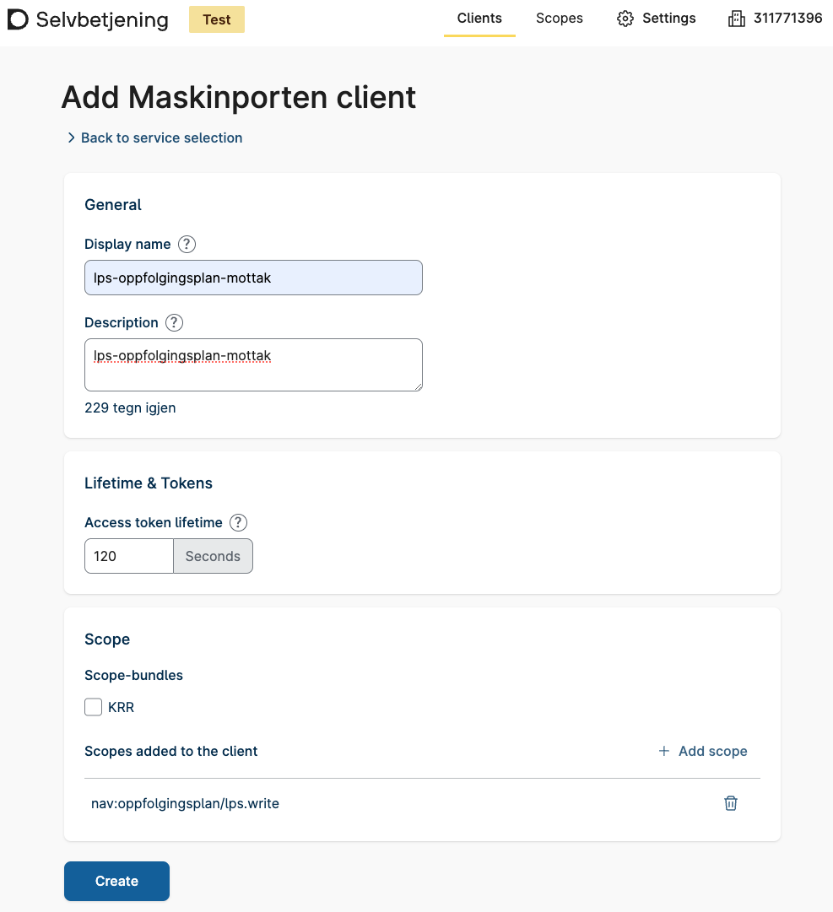
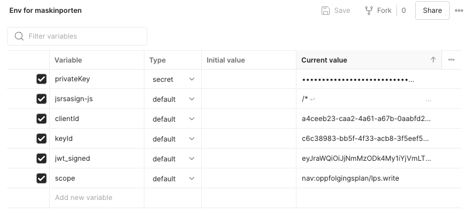
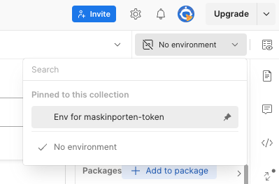
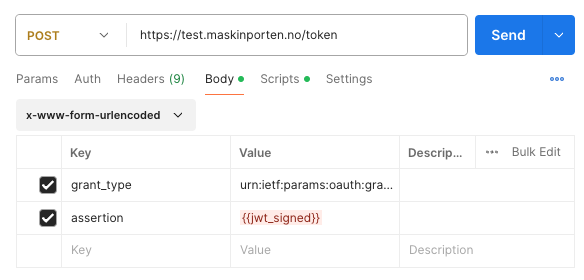

# API - Testing guide

## Table of Contents
1. [Finding Test Users](#finding-test-users)
2. [Set Up Integration in Maskinporten](#set-up-integration-in-maskinporten)
3. [Fetching a Maskinporten Token using Postman](#fetching-a-maskinporten-token-using-postman)
4. [Testing the Integration](#testing-the-integration)

---

## Finding Test Users
You will need to find one test user from Test-Norge. The following tools can be used to find test users:

### TestID
The easiest way to find a random test user.
1. Navigate to [Altinn Test Environment](https://tt02.altinn.no) and click **Logg inn**.
2. Click **TestID på nivå høyt**.
3. Click **Hent tilfeldig daglig leder**.
4. Take note of the social security number (*Personidentifikator*).

### Tenor testdatasøk
If you need more fine-grained control over the test user.
1. Navigate to [Tenor testdatasøk](https://testdata.skatteetaten.no/web/testnorge/soek/freg).
2. You must log in with your personal user, e.g. **BankID**.
3. Find test user of your choice.
4. Take note of the social security number.

---

## Set Up Integration in Maskinporten
1. **Log into Forenklet onboarding:**
    - Navigate to [Maskinporten selvbetjening](https://sjolvbetjening.test.samarbeid.digdir.no)
    - Log in using your own BankId.
    - Choose the synthetic org you want to represent, or create a new. You can change this later.

2. **Create MAskinporten Client:**
    - Select the relevant company and click **Next**
    - Click "+Create Client"
    - Choose "Maskinporten"
    - Set the name you want for the client.
    - Select the scope you want to use. (You can search for scopes from Nav)
    - Click "Create" then select your newly created Client
    - Make a note of your clientId (You can also find it again later using [Maskinporten selvbetjening](https://sjolvbetjening.test.samarbeid.digdir.no))
      
3. **Add key to your client:**
  - Select your create key.
  - Select the "Keys" tab and click "+Add"
  - Create a pair of private and public PEM keys. For instance using commands like these.
  - Make a note of your keyId (You can also find it again later using [Maskinporten selvbetjening](https://sjolvbetjening.test.samarbeid.digdir.no))
```bash
openssl genpkey -algorithm RSA -out maskinporten-rs256.priv.key -pkeyopt rsa_keygen_bits:4096
openssl rsa -in maskinporten-rs256.priv.key -pubout -out maskinporten-rs256.pub.key
```
  - Paste the content of the public key into the "Add key" dialog
  - Make a note of your keyId (You can also find it again later using [Maskinporten selvbetjening](https://sjolvbetjening.test.samarbeid.digdir.no))

## Fetching a Maskinporten Token using Postman
1. **Create a New Request:**
    - Method: `POST`
    - URL: `https://test.maskinporten.no/token`
2. **Create a new Environment:**
    - Add a new variable for the `jsrasign` library
        - name: `jsrsasign-js`
        - current value: Copy the [latest jsrsasign library](http://kjur.github.io/jsrsasign/jsrsasign-latest-all-min.js) 
    - Add a new variable for your private key
        - name: `privateKey`
        - type: `secret`
        - current value: Your private key that was generated in the *Set Up Integration In Maskinporten* step
    - Add a new variable for your Maskinporten clientId 
      - name: `clientId`
      - type: `default`
      - current value: The clientId that was created for you in the *Set Up Integration In Maskinporten* step
    - Add a new variable for id of the key you added to your client
       - name: `keyId`
       - type: `default`
       - current value: Key ID that was created for you in the *Set Up Integration In Maskinporten* step
    - Add a new variable for your the scope you want to create a token for
       - name: `scope`
       - type: `default`
       - current value: Use the scope from the *Set Up Integration In Maskinporten* step

         
    - Save the environment
    - Select the new environment

        
3. **Add a Pre-request Script:**
    - Add a new Pre-request script from the `Scripts` tab with the following content
        ```javascript
        var uuid = require("uuid");
        var navigator = {};
        var window = {};
        eval(pm.environment.get("jsrsasign-js"));
        var currentTimestamp = Math.floor(Date.now() / 1000)
        var issuer =  pm.environment.get("clientId")
        var kid =  pm.environment.get("keyId")
        var scope =  pm.environment.get("scope")
        var consumerOrg =  pm.environment.get("onBehalfOfOrgnummer")
        // JWT headers
        var header = {
            "kid": kid,                             // KID - Integrations Key ID
            "alg": "RS256"                          // Algorithm used to generate keys
        };
        // JWT data
        var data = {
            "aud": "https://test.maskinporten.no/", // Audience - Maskinporten test
            "iss": issuer,                          // Issuer - Integration ID
            "scope": scope,                         // Scope created by Nav
            "iat": currentTimestamp,
            "exp": (currentTimestamp + 180),
            "jti": uuid.v4(),
            "consumer_org": consumerOrg,
        }

        var sHeader = JSON.stringify(header);
        console.log("sHeader", sHeader);
        var sPayload = JSON.stringify(data);
        console.log("sPayload", sPayload);
        var privateKey = pm.environment.get("privateKey"); // Get private key from environment
        
        // JWK signed
        var sJWT = KJUR.jws.JWS.sign(
            header.alg, sHeader, sPayload, privateKey
        );
        // Save signed JWK
        pm.environment.set('jwt_signed', sJWT);            // Creates new environment variable
        ```

4. **Body:**
    - In the `Body` tab select `x-www-form-urlencoded`
    - Include the following parameters:
        - `grant_type: urn:ietf:params:oauth:grant-type:jwt-bearer`
        - `assertion: {{jwt_signed}}`

        
5. **Send Request:**
    - Click **Send** to get a valid Maskinporten access token, which can be used against the NAV API.

---

## Testing the Integration

- Ensure the integration works by using the data from the created integration, private key matching the public key, and the organization number of the represented entity.
- A valid token from Maskinporten should be obtained, which can be used against the NAV API.
