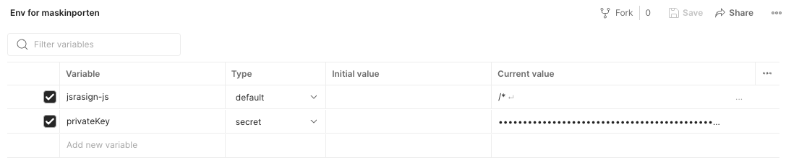
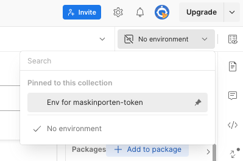
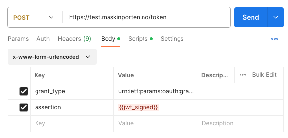

# Delegable API - Testing guide

## Table of Contents
1. [Finding Test Users](#finding-test-users)
2. [Delegating API Access in Altinn](#delegating-api-access-in-altinn)
3. [Set Up Integration in Maskinporten](#set-up-integration-in-maskinporten)
3. [Fetching a Maskinporten Token using Postman](#fetching-a-maskinporten-token-using-postman)
4. [Testing the Integration](#testing-the-integration)

---

## Finding Test Users
You will need to find two test users from Test-Norge. 
* The first user is acting as the *supplier* (LPS - Lønns- og personalsystem)
* The second user is acting as the *customer* ("end-user"-company that will use the LPS system)

The following tools can be used to find test users:

### TestID
The easiest way to find a random test user.
1. Navigate to [Altinn Test Environment](https://tt02.altinn.no) and click **Logg inn**.
2. Click **TestID på nivå høyt**.
3. Click **Hent tilfeldig daglig leder**.
4. Take note of the organization number (*Organisasjonsnummer*) and social security number (*Personidentifikator*).
5. You can click **Hent tilfeldig daglig leder** one more time to get the second test user.

### Tenor testdatasøk
If you need more fine-grained control over the test users.
1. Navigate to [Tenor testdatasøk](https://testdata.skatteetaten.no/web/testnorge/soek/freg).
2. You must log in with your personal user, e.g. **BankID**.
3. Find test users of your choice.
4. Take note of the organization number and social security number.

---

## Delegating API Access in Altinn
This section describes how the customer can delegate API-access to a supplier.

### Step 1: Log into Altinn
1. Navigate to the [Altinn Test Environment](https://tt02.altinn.no).
2. Click **Logg inn**.
3. Click **TestID på nivå høyt**.
4. Use your customer test user's social security number.
5. Click **Autentiser**.

### Step 2: Navigate to Delegable API
1. Select the customer company.
2. Click **profile** in the top menu.
3. Click **Access to the application programming interface - API**.
4. Click **Give and remove API accesses**.

### Step 3: Delegate API Access
1. Search for the API:
    - Click **Delegate new API**.
    - Click the **+** to add the API you wish to delegate access to.
    - Ensure it is added and click **Next**.
2. Find the supplier/organization to delegate to:
    - Search for the supplier's organization number.
    - Add them by clicking the **+**.
    - Click **Next** and then **Confirm**.
3. The supplier will now be able to access the API on behalf of the customer when requesting a token from Maskinporten.

---

## Set Up Integration in Maskinporten
1. **Log into Forenklet onboarding:**
    - Navigate to [Maskinporten Onboarding Pilot](https://onboarding.test.maskinporten.no/)
    - Log in using TestID with the supplier's social security number.
2. **Create Integration:**
    - Select the supplier company and click **Next**
    - Click **Legg til en offentlig tilgang**
    - Search for "nav" and select the correct api
    - Add a description
    - Select integration method **Med nøkkel (Generer for meg)**
    - Set up a new integration and note the integration ID, scope and keys for later use.

---

## Fetching a Maskinporten Token using Postman
1. **Create a New Request:**
    - Method: `POST`
    - URL: `https://test.maskinporten.no/token`
2. **Create a new Environment:**
    - Add a new variable for the `jsrasign` library
        - name: `jsrsasign-js`
        - current value: Copy the [latest jsrsasign library](http://kjur.github.io/jsrsasign/jsrsasign-latest-all-min.js) 
    - Add a new variable for your private key
        - name: `privateKey`
        - type: `secret`
        - current value: Your private key that was generated in the *Set Up Integration In Maskinporten* step
        
        
    - Save the environment
    - Select the new environment

        
3. **Add a Pre-request Script:**
    - Add a new Pre-request script from the `Scripts` tab with the following content
        ```javascript
        var uuid = require("uuid");
        var navigator = {};
        var window = {};
        eval(pm.environment.get("jsrsasign-js"));
        var currentTimestamp = Math.floor(Date.now() / 1000)
        // JWT headers
        var header = {
            "kid": "<REPLACE>",                            // KID - Integrations Key ID
            "alg": "RS256"                                 // Algorithm used to generate keys
        };
        // JWT data
        var data = {
            "aud": "https://test.maskinporten.no/",        // Audience - Maskinporten test
            "iss": "<REPLACE>",                            //Issuer - Integration ID
            "scope": "<REPLACE>",                          // Scope created by Nav
            "consumer_org": "<REPLACE>",                   // Organization number you want to represent
            "iat": currentTimestamp, 
            "exp": (currentTimestamp + 180),
            "jti": uuid.v4(),
        }
        var sHeader = JSON.stringify(header);
        console.log("sHeader", sHeader);
        var sPayload = JSON.stringify(data);
        console.log("sPayload", sPayload);
        var privateKey = pm.environment.get("privateKey"); // Get private key from environment
        
        // JWK signed
        var sJWT = KJUR.jws.JWS.sign(
            header.alg, sHeader, sPayload, privateKey
        );
        // Save signed JWK
        pm.environment.set('jwt_signed', sJWT);            // Creates new environment variable
        ```
    - Replace the following variables:
        - `kid`: Use the Key-id from Forenklet Onboarding
        - `iss`: Use the IntegrasjonsId from Forenklet Onboarding
        - `scope`: Use the scope from Forenklet Onboarding
        - `consumer_org`: Use the consumer company organization number

           
4. **Body:**
    - In the `Body` tab select `x-www-form-urlencoded`
    - Include the following parameters:
        - `grant_type: urn:ietf:params:oauth:grant-type:jwt-bearer`
        - `assertion: {{jwt_signed}}`

        
5. **Send Request:**
    - Click **Send** to get a valid Maskinporten access token, which can be used against the NAV API.

---

## Testing the Integration

- Ensure the integration works by using the data from the created integration, private key matching the public key, and the organization number of the represented entity.
- A valid token from Maskinporten should be obtained, which can be used against the NAV API.
