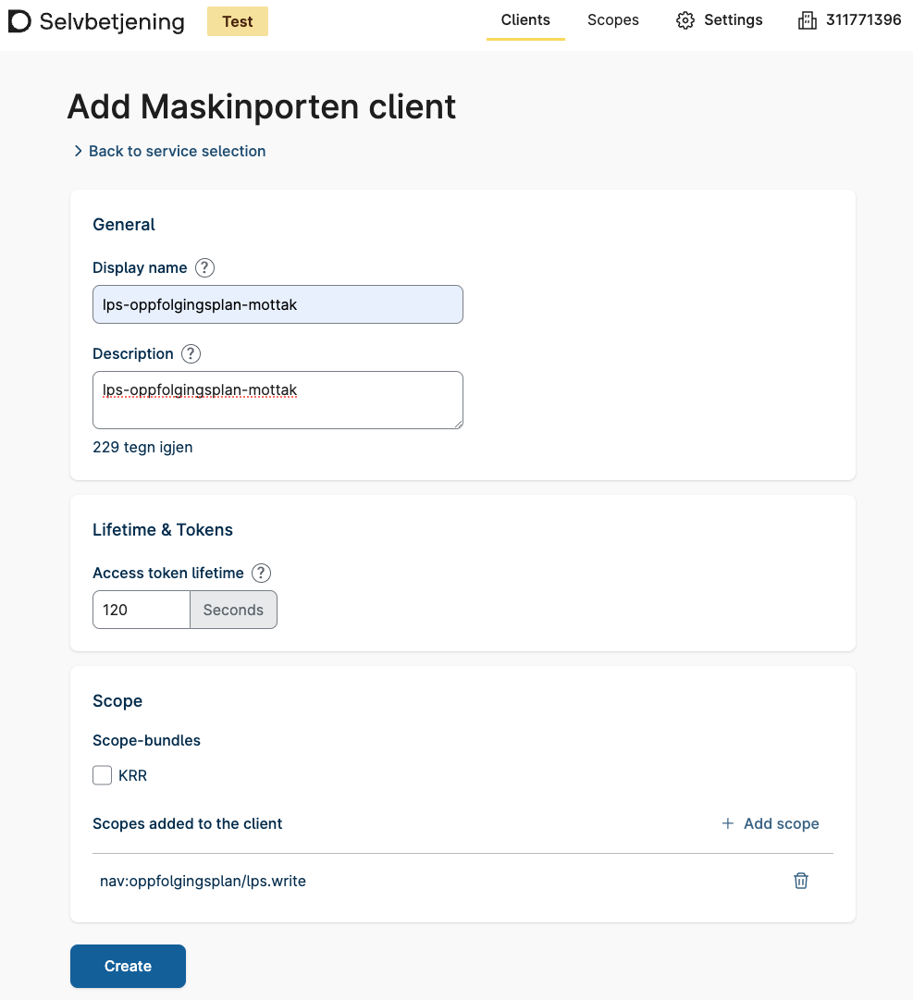
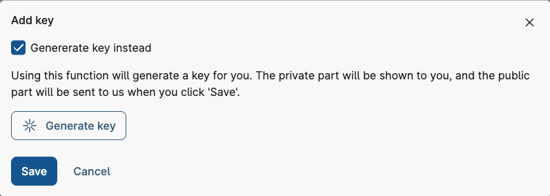

# Delegable API - Testing guide

## Table of Contents

1. [Finding Test Users](#finding-test-users)
2. [Delegating API Access in Altinn](#delegating-api-access-in-altinn)
3. [Set Up Integration in Maskinporten](#set-up-integration-in-maskinporten)
4. [Fetching a Maskinporten Token using Postman](#fetching-a-maskinporten-token-using-bruno-or-postman)
5. [Testing the Integration](#testing-the-integration)

---

## Finding Test Users

You will need to find two test users from Test-Norge.

* The first user is acting as the *supplier* (e.g. LPS - Lønns- og personalsystem)
* The second user is acting as the *customer* ("end-user"-company that will use the LPS system)

The following tools can be used to find test users:

### TestID

The easiest way to find a random test user.

1. Navigate to [Altinn Test Environment](https://tt02.altinn.no) and click **Logg inn**.
2. Click **TestID på nivå høyt**.
3. Click **Hent tilfeldig daglig leder**.
4. Take note of the organization number (*Organisasjonsnummer*) and social security number (*Personidentifikator*).
5. Log in with the user, this is important for Altinn to recognize the user as a test user.
6. Log out and click **Logg inn** again, then repeat steps 2 to 5 again to prepare the secon test user.
   Alternatively you can log inn to [Altinn Test Environment](https://tt02.altinn.no) in an incognito tab and repeat
   steps 2 to 5 to keep both session alive simultaneously

### Tenor testdatasøk

If you need more fine-grained control over the test users.

1. Navigate to [Tenor testdatasøk](https://testdata.skatteetaten.no/web/testnorge/soek/freg).
2. You must log in with your personal user, e.g. **BankID**.
3. Find test users of your choice.
4. Take note of the organization number and social security number.

---

## Delegating API Access in Altinn

This section describes how the customer can delegate API-access to a supplier.

### Step 1: Log into Altinn

1. Navigate to the [Altinn Test Environment](https://tt02.altinn.no), or use an existing logged in session if you have
   one.
2. Click **Logg inn**.
3. Click **TestID på nivå høyt**.
4. Use your customer test user's social security number.
5. Click **Autentiser**.

### Step 2: Navigate to Delegable API

1. Select the customer company.
2. Take note of the company's organization number - this is used later when requesting token from Maskinporten.
3. Click **profile** in the top menu.
4. Click **Access to the application programming interface - API**.
5. Click **Give and remove API accesses**.

### Step 3: Delegate API Access

1. Search for the API:
    - Click **Delegate new API**.
    - Click the **+** to add the API you wish to delegate access to.
    - Ensure it is added and click **Next**.
2. Find the supplier/organization to delegate to:
    - Search for the supplier's organization number.
    - Add them by clicking the **+**.
    - Click **Next** and then **Confirm**.
3. The supplier will now be able to access the API on behalf of the customer when requesting a token from Maskinporten.

---

## Set Up Integration in Maskinporten

1. **Log into Selvbetjening for Maskinporten at DigDir:**
    - Navigate to [Maskinporten selvbetjening](https://sjolvbetjening.test.samarbeid.digdir.no)
    - Choose if you want to use an existing org you have access to, or if you want to create a synthetic org.
    - Log in using your own BankId.

2. **Create Maskinporten Client:**
    - Click "+Create Client"
    - Choose "Maskinporten"
    - Set the name you want for the client.
    - Select the scope you want to use. (You can search for scopes from Nav)
    - Click "Create" then select your newly created Client
    - Make a note of your clientId (You can also find it again later
      using [Maskinporten selvbetjening](https://sjolvbetjening.test.samarbeid.digdir.no))

      

3. **Add key to your client:**

You need to add a key to your client. This key will be used to sign the JWT used to fetch a token from Maskinporten.

- Select the "Keys" tab and click "+ Add key"
- You have now two choices:
    - Automatic key generation by Maskinporten: Choose flag "Generate key instead" and the button "Generate key". This
      will create a pair of private and public PEM keys. Make a note of your private key (You can only see it
      once). 
    - Manual key generation: Choose flag "Add key". Create a pair of private and public PEM keys. For instance using
      commands like these:
      ```bash
      openssl genpkey -algorithm RSA -out maskinporten-rs256.priv.key -pkeyopt rsa_keygen_bits:4096
      openssl rsa -in maskinporten-rs256.priv.key -pubout -out maskinporten-rs256.pub.key
      ```
      Paste the content of the public key into the "Add key" dialog
- Make a note of your keyId (You can also find it again later
  using [Maskinporten selvbetjening](https://sjolvbetjening.test.samarbeid.digdir.no))

---

## Fetching a Maskinporten Token using Bruno or Postman

1. **Create a New Request:**
    - Method: `POST`
    - URL: `https://test.maskinporten.no/token`
2. **Create a new Environment:**
    - Add a new variable for the `jsrasign` library (only required for Postman)
        - name: `jsrsasign-js`
        - current value: Copy
          the [latest jsrsasign library](http://kjur.github.io/jsrsasign/jsrsasign-latest-all-min.js)
    - Add a new variable for your private key
        - name: `privateKey`
        - type: `secret`
        - current value: Your private key that was generated in the *Set Up Integration In Maskinporten* step
    - Add a new variable for your Maskinporten clientId
        - name: `clientId`
        - type: `default`
        - current value: The clientId that was created for you in the *Set Up Integration In Maskinporten* step
    - Add a new variable for id of the key you added to your client
        - name: `keyId`
        - type: `default`
        - current value: Key ID that was created for you in the *Set Up Integration In Maskinporten* step
    - Add a new variable for the scope you want to create a token for
        - name: `scope`
        - type: `default`
        - current value: Use the scope from the *Set Up Integration In Maskinporten* step
    - Add a new variable for the orgnumer you want to represent
        - name: `onBehalfOfOrgnummer`
        - type: `default`
        - current value: The orgnumer you are going to represent when using the token from Maskinporten

      
    - Save the environment
    - Select the new environment

      

3. **Add a Pre-request Script:**

The pre-request script generates a signed JWT using the private key and other environment variables.  
It then stores the signed token as an environment variable named `jwt_signed`, which is later used in the request body.  

You can add the script in the **Scripts** tab, either in Bruno or Postman:

[Pre-request script for Bruno](../scripts/pre-request-script-bruno.js)

[Pre-request script for Postman](../scripts/pre-request-script-postman.js)

4. **Body:**
    - In the `Body` tab select `x-www-form-urlencoded`
    - Include the following parameters:
        - `grant_type: urn:ietf:params:oauth:grant-type:jwt-bearer`
        - `assertion: {{jwt_signed}}`

      

5. **Send Request:**
    - Click **Send** to get a valid Maskinporten access token, which can be used against the NAV API.

---

## Testing the Integration

- Ensure the integration works by using the data from the created integration, private key matching the public key, and
  the organization number of the represented entity.
- A valid token from Maskinporten should be obtained, which can be used against the NAV API.
